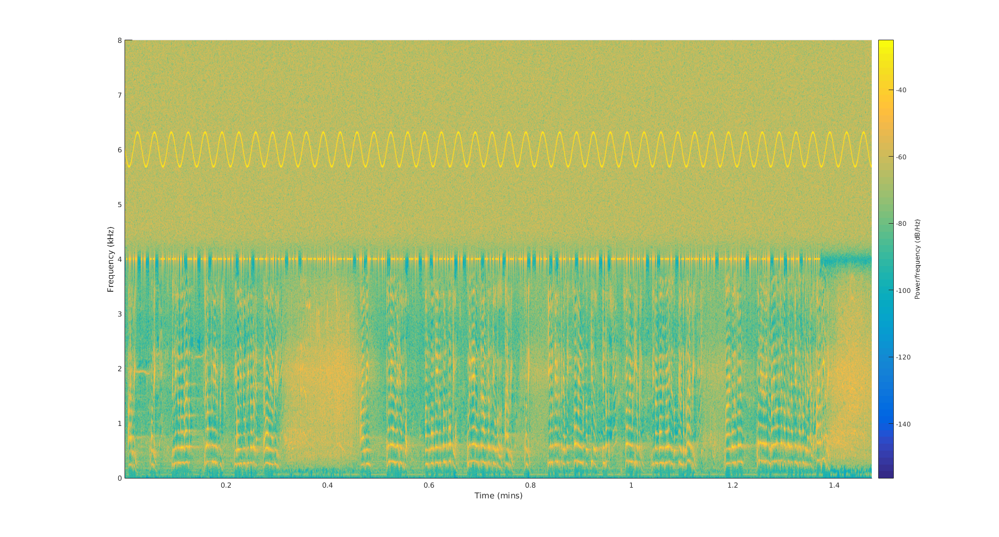
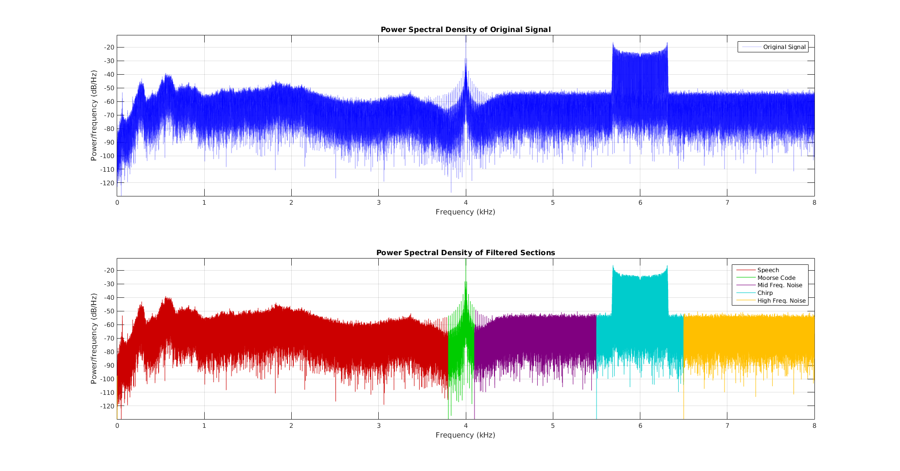
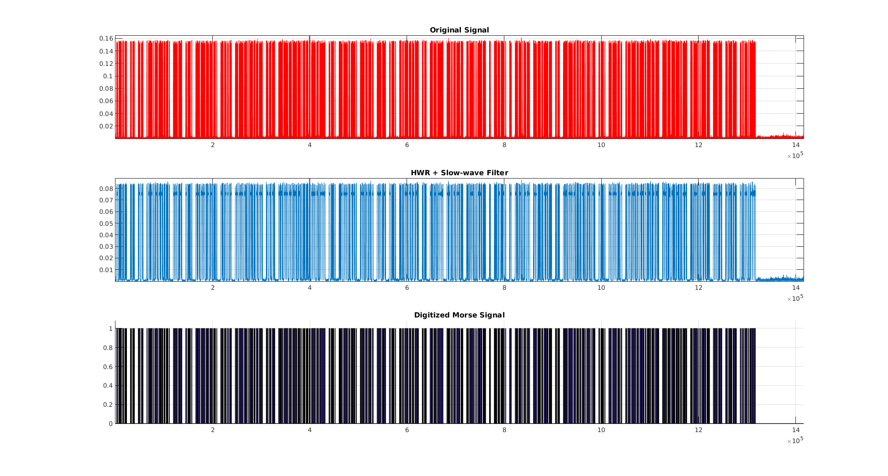
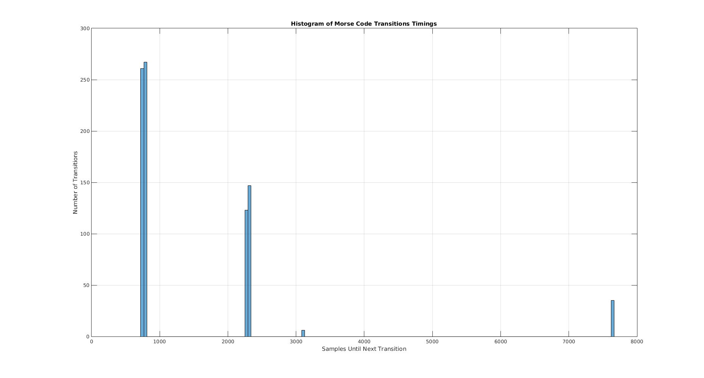
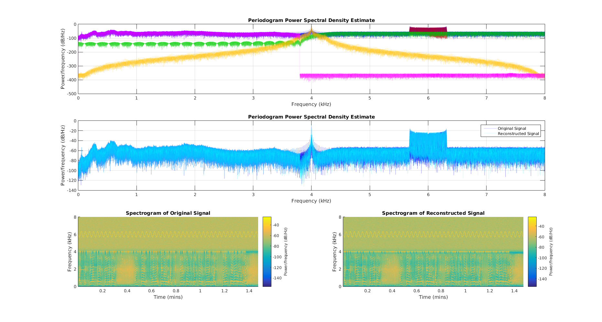

# Data Compression & Modeling :speaker:

This project is the analysis and compression of an audio signal, [Signal.wav](https://raw.githubusercontent.com/jjones646/ece6260/master/includes/Signal.wav). Most browsers will natively support playing the [mp3 version](https://raw.githubusercontent.com/jjones646/ece6260/master/doc/Signal.mp3) for reference of what this signal sounds like.

The spectrogram below shows the raw signal.

## Prerequisites

You will need [MATLAB](http://www.mathworks.com/products/matlab/) to run the scripts.

## Usage

### Encoding
To encode the [Signal.wav](https://raw.githubusercontent.com/jjones646/ece6260/master/includes/Signal.wav) file, run the [encoder_main.m](./encoder_main.m) script using [MATLAB](http://www.mathworks.com/products/matlab/).

### Decoding
**TODO**

## License
This project is licensed under the MIT License - see the [LICENSE.md](./LICENSE.md) file for details.

## Algorithm Approach

### Conceptual

|Signal Segmentation|
|:---|
|Bandpass filters are used to divide [Signal.wav](https://raw.githubusercontent.com/jjones646/ece6260/master/includes/Signal.wav) into manageable sections. The `fftFilter` function in [fftFilter.m](./includes/fftFilter.m) is used for the initial segmentation. A relevant compression technique is then applied for each section, which are shown below.|
||
|The signal is broken down into these 5 parts:<ul><li>Speech</li><li>Morse Code</li><li>Mid. Freq. Noise</li><li>Chirp</li><li>High Freq. Noise</li></ul>|

### Section Implementations

|Speech|
|:---|
|6 methods were tested for the speech compression. The best performance comes from feedback adaptive quantizer - compressing to less than `200kB` with an SQNR of `10dB`.|
|**TODO:**|

|Morse Code|
|:---|
|The original [Signal.wav](https://raw.githubusercontent.com/jjones646/ece6260/master/includes/Signal.wav) file contains Morse Code in the background audio. One of the steps involved for its compression is to first decode the signal. The bulk of this is handled with the `deMorse` function from [deMorse.m](./includes/deMorse.m), and some of its steps are shown below.|
||
|See [morse_main.m](./morse_main.m) for more things dealing with the Morse Code portion of the signal, like this histogram of symbol timings or the huffman code [here](./doc/huffman-code.md).|
||

|Chirp|
|:---|
|The sinusodial chirp in the signal is reconstructed from the equation below during decompression.|
|**TODO:** equation here|

|Noise|
|:---|
|**TODO**|
|**TODO:**|

## Results

|Generated Sections|
|:---|
|The upper frequencies for the graphs shown below were generated from structural parameters. See [testbench.m](./testbench.m) for implementation details.|
||

