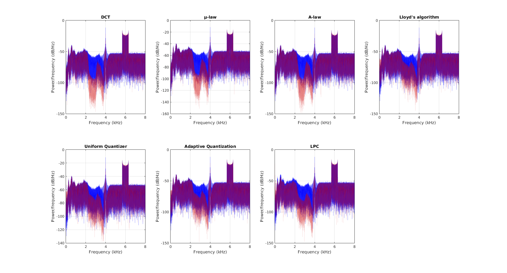
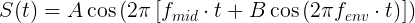

# Data Compression & Modeling :speaker:

This project is the analysis and compression of an audio signal, [Signal.wav](https://raw.githubusercontent.com/jjones646/ece6260/master/includes/Signal.wav).

The spectrogram below shows the raw signal.

## Prerequisites

You will need [MATLAB](http://www.mathworks.com/products/matlab/) to run the scripts.

## Usage

To export encoded & reconstructed files from the original [Signal.wav](https://raw.githubusercontent.com/jjones646/ece6260/master/includes/Signal.wav) file, run the [project_main.m](./project_main.m) script using [MATLAB](http://www.mathworks.com/products/matlab/).

## License
This project is licensed under the MIT License - see the [LICENSE.md](./LICENSE.md) file for details.

## Algorithm Approach

### Conceptual

|Signal Segmentation|
|:---|
|Bandpass filters are used to divide [Signal.wav](https://raw.githubusercontent.com/jjones646/ece6260/master/includes/Signal.wav) into manageable sections. The `fftFilter` function in [fftFilter.m](./includes/fftFilter.m) is used for the initial segmentation. A relevant compression technique is then applied for each section, which are shown below.|
|The signal is broken down into these 3 parts:<ul><li>Speech</li><li>Morse Code</li><li>Chirp</li></ul>|
||

### Section Implementations

|Speech|
|:---|
|7 compression schemes are tested for the speech section of the signal.|
||

|Morse Code|
|:---|
|The original [Signal.wav](https://raw.githubusercontent.com/jjones646/ece6260/master/includes/Signal.wav) file contains Morse Code in the background audio. One of the steps involved for its compression is to first decode the signal. The [`makeMorse`](./includes/makeMorse.m) function is used for reconstruction of the message during decompression|
||

|Chirp|
|:---|
|The sinusodial chirp in the signal is reconstructed from the equation below during decompression.|
||

